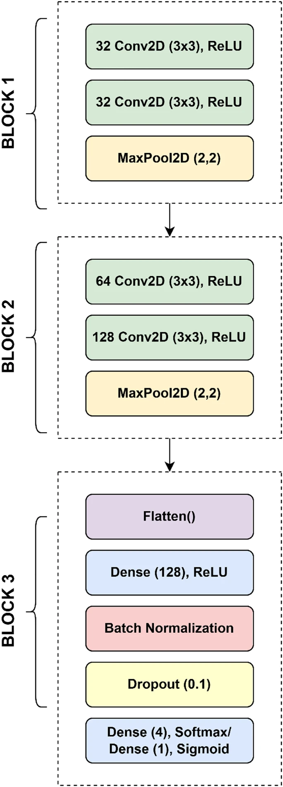
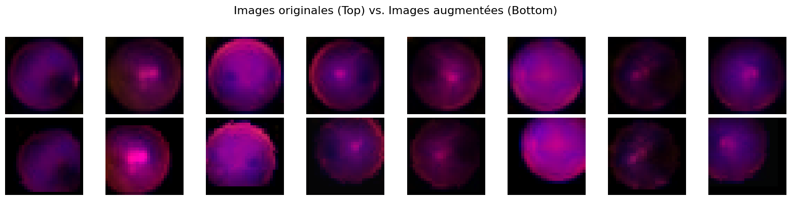

# Retinal Image Classification - Kaggle Competition

**Course:** IFT 3395/6390 - Machine Learning  
**Competition:** [Kaggle 2 Competition Fall 2025](https://www.kaggle.com/competitions/ift-3395-6390-kaggle-2-competition-fall-2025)

## Project Overview

This project implements machine learning models to classify 28×28 RGB images into 5 quality classes (0-4). Two main approaches were developed:
- **Kernel SVM** with RBF kernels and one-vs-rest strategy
- **Convolutional Neural Network (CNN)** with extensive data augmentation

## Dataset

- **Training set:** 1,080 images (28×28×3)
- **Test set:** 400 images (28×28×3)
- **Classes:** 5 quality levels (0 = lowest, 4 = highest)

## Setup

### Environment Setup

Create a virtual environment (preferably `conda`) and install dependencies:

```bash
pip install -r requirements.txt
```

### Jupyter Notebook Configuration

To use the notebooks with Jupyter, add the environment as a kernel:

```bash
python -m ipykernel install --user --name <env_name> --display-name "Python (<env_name>)"
```

## Implementation Details

### Kernel SVM (`kernel_svm.ipynb`)

- **Kernel:** RBF (Radial Basis Function) with γ = 0.1
- **Strategy:** One-vs-rest multiclass classification
- **Regularization:** λ = 0.01
- **Training:** Gradient descent with step size 0.01 (500 iterations)
- **Performance:** ~46% test accuracy (on the Kaggle competition)


### CNN (`cnn.ipynb`)

- **Architecture:**
  The architecture followed is from the following paper: https://www.nature.com/articles/s41598-025-87171-9
    
  
- **Data Augmentation** (10 expansion):

- **Training:**
  - Optimizer: SGD (lr=0.001)
  - Loss: CrossEntropyLoss
  - Epochs: 10
  - Batch size: 64

- **Performance:** ~53% training accuracy, ~51% validation accuracy, ~52% test accuracy (on the public Kaggle competition)


# Data Augmentation
The small training set (1,080 images) was expanded 10× through extensive augmentation. 

A combination of geometric transformations (rotation, cropping, affine, perspective), color adjustments (brightness, contrast, saturation), and other techniques (flipping, Gaussian blur) was applied to improve model generalization and prevent overfitting.


